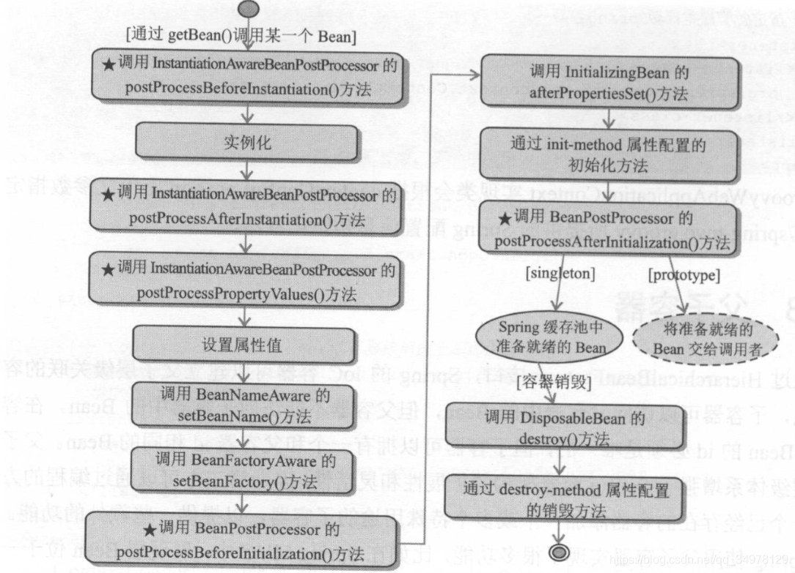

纯BeanFactory的demo，看看原始BeanFactory怎么使用

真正的spring项目里不会直接使用BeanFactory，至少很少使用

BeanFactory的生命周期

BeanFactory的延迟加载：
- 只要不getBean就不会真正的实例化bean，就不会触发生命周期，只注册BeanDefinition
- 同样也不触发BeanPostProcessor  
- 这一点区别于ApplicationContext，ApplicationContext会对所有的bean调用一次getBean，以避免第一次惩罚的问题，延迟加载的bean除外